# IFLA Standards Documentation Management System

## Executive Summary

The International Federation of Library Associations and Institutions (IFLA) requires a comprehensive system for managing library standards documentation that supports multiple versions, languages, and synchronized vocabularies. This document outlines a complete solution leveraging Docusaurus, GitHub, and modern web technologies to create an accessible, maintainable, and scalable standards management ecosystem.

## Table of Contents

1. [System Overview](#system-overview)
2. [Key Stakeholders](#key-stakeholders)
3. [Technical Architecture](#technical-architecture)
4. [Workflow Components](#workflow-components)
5. [Implementation Details](#implementation-details)
6. [Security and Permissions](#security-and-permissions)
7. [Integration Points](#integration-points)
8. [Deployment Strategy](#deployment-strategy)
9. [Maintenance and Support](#maintenance-and-support)

## System Overview

### Problem Statement

IFLA.org needs a comprehensive solution to:
- Manage library standards documents with integrated RDF vocabularies
- Support multiple versions and languages
- Enable collaborative editing by subject matter experts
- Maintain synchronization between documentation and vocabularies
- Support both new and legacy standards
- Provide accessible tools for non-technical users

### Solution Architecture

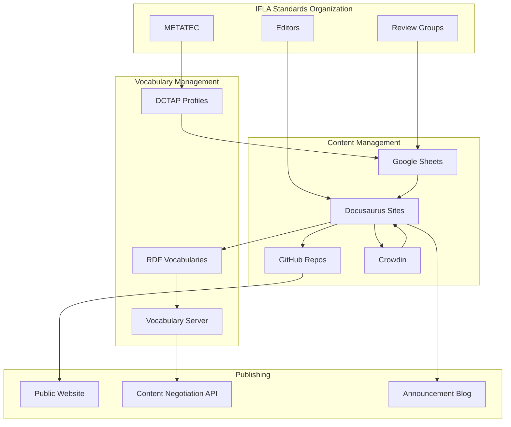

## Key Stakeholders

### 1. Review Groups (RG)
- **Role**: Subject matter experts responsible for standard evolution
- **Needs**: Easy-to-use editing tools, collaborative workflows
- **Technical Level**: Low to moderate

### 2. METATEC Technical Working Group
- **Role**: Central technical standards and infrastructure
- **Responsibilities**:
  - Maintain Docusaurus templates
  - Provide DCTAP profiles
  - Support workflow automation
  - Technical guidance

### 3. Managing Editors
- **Role**: Coordinate review processes and publishing
- **Permissions**: Full repository access
- **Tasks**: Version management, publication coordination

### 4. Contributors
- **Role**: Active participants in standard development
- **Access**: Write access to documentation
- **Workflow**: Pull requests and reviews

## Technical Architecture

### Core Technologies

#### Docusaurus Advantages
1. **Content Management**
   - MDX support for rich content
   - Built-in versioning
   - i18n internationalization
   - Static site generation
   - GitHub integration

2. **Developer Experience**
   - React-based extensibility
   - Plugin ecosystem
   - Hot reload development
   - TypeScript support

3. **User Experience**
   - Fast performance
   - Search functionality
   - Responsive design
   - Dark mode support
   - Accessible by default

### DCTAP (Dublin Core Tabular Application Profiles)

DCTAP provides a standardized way to define metadata schemas using spreadsheets:

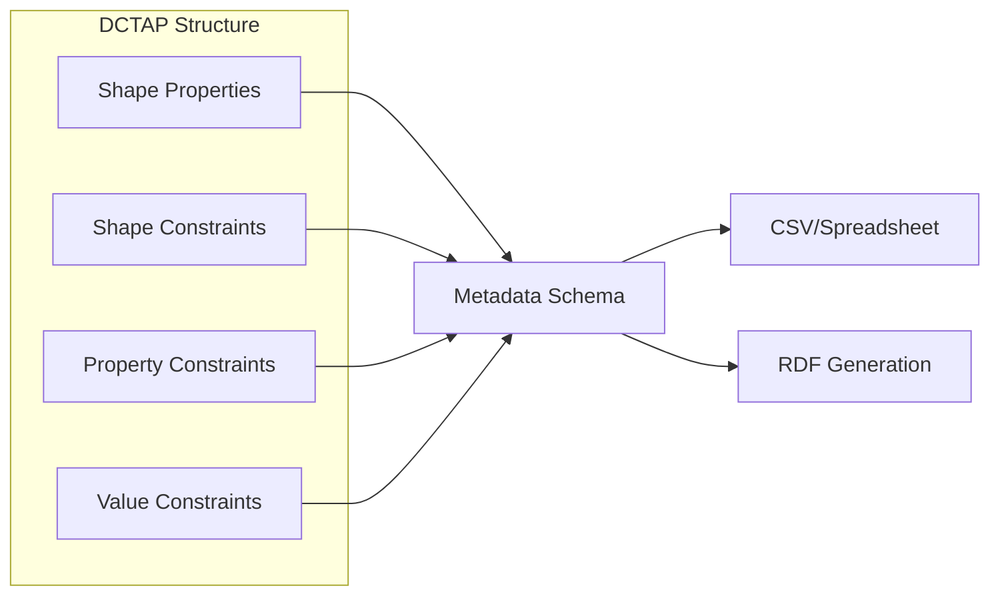

**DCTAP Benefits:**
- Human-readable spreadsheet format
- Machine-processable
- Validation rules
- Documentation integrated
- Standards-based approach

### Front Matter and MDX

Front matter allows embedding structured data in documentation:

```yaml
---
id: element-001
title: Title Element
rdf:
  "@context": "https://www.w3.org/ns/csvw"
  "@type": "Property"
  "rdfs:label": "Title"
  "rdfs:comment": "The name given to the resource"
  "rdfs:domain": "Resource"
  "rdfs:range": "Literal"
version: 1.0.0
status: stable
---
```

MDX enables React components in Markdown:
```mdx
# Title Element

<ElementDefinition 
  mandatory={true}
  repeatable={false}
  vocabulary="title-types"
/>

## Usage Guidelines
...
```

## Workflow Components

### 1. DCTAP Profile Selection and Customization

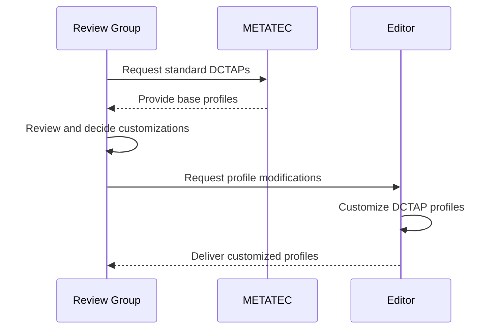

### 2. Spreadsheet Template Generation

```typescript
// Example: Generate spreadsheet from DCTAP
interface DCTAPProfile {
  shapes: Shape[];
  properties: Property[];
  constraints: Constraint[];
}

async function generateSpreadsheetTemplate(
  profile: DCTAPProfile,
  existingVocab?: RDFVocabulary
): Promise<GoogleSpreadsheet> {
  const sheet = await createSheet({
    title: `${profile.name} - Vocabulary Template`,
    sheets: [
      { name: 'Elements', headers: ELEMENT_HEADERS },
      { name: 'Values', headers: VALUE_HEADERS },
      { name: 'Constraints', headers: CONSTRAINT_HEADERS }
    ]
  });
  
  if (existingVocab) {
    await populateFromExisting(sheet, existingVocab);
  }
  
  await shareWithReviewGroup(sheet, profile.reviewGroup);
  return sheet;
}
```

### 3. Collaborative Editing Workflow

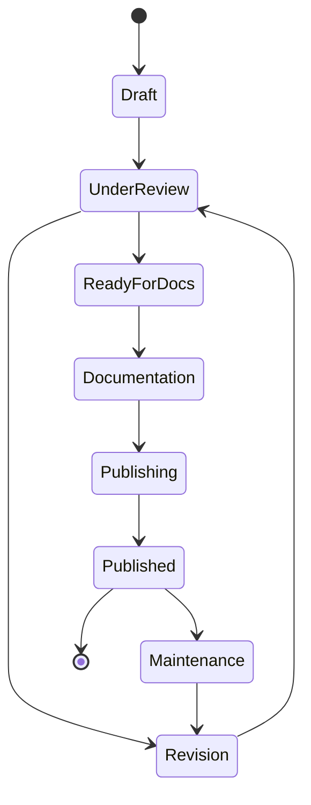

### 4. Documentation Generation

```typescript
// Generate skeleton documentation from spreadsheets
interface VocabularyEntry {
  id: string;
  label: string;
  definition: string;
  rdfProperties: RDFProperties;
}

async function generateDocumentation(
  spreadsheet: GoogleSpreadsheet,
  template: DocusaurusTemplate
): Promise<GeneratedDocs> {
  const entries = await parseSpreadsheet(spreadsheet);
  const docs: GeneratedDoc[] = [];
  
  for (const entry of entries) {
    const doc = await generateMDXFile({
      frontMatter: {
        id: entry.id,
        title: entry.label,
        rdf: entry.rdfProperties,
        version: '1.0.0',
        status: 'draft'
      },
      content: template.render(entry),
      components: template.components
    });
    
    docs.push(doc);
  }
  
  return { docs, manifest: generateManifest(docs) };
}
```

### 5. Version Management

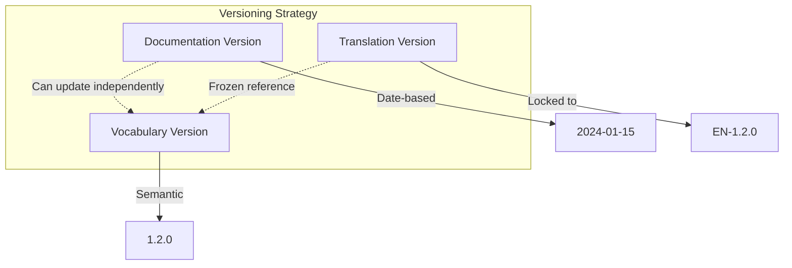

### 6. RDF Harvesting and Publishing

```typescript
// Harvest RDF from documentation pages
async function harvestRDF(docsPath: string): Promise<RDFGraph> {
  const graph = new RDFGraph();
  const files = await glob(`${docsPath}/**/*.mdx`);
  
  for (const file of files) {
    const { frontMatter } = await parseMDX(file);
    if (frontMatter.rdf) {
      graph.add(frontMatter.rdf);
    }
  }
  
  // Add vocabulary-level metadata
  graph.addVocabularyMetadata({
    version: process.env.VOCAB_VERSION,
    issued: new Date().toISOString(),
    publisher: 'IFLA'
  });
  
  return graph;
}
```

### 7. Content Negotiation

Content negotiation allows serving different formats based on client preferences:

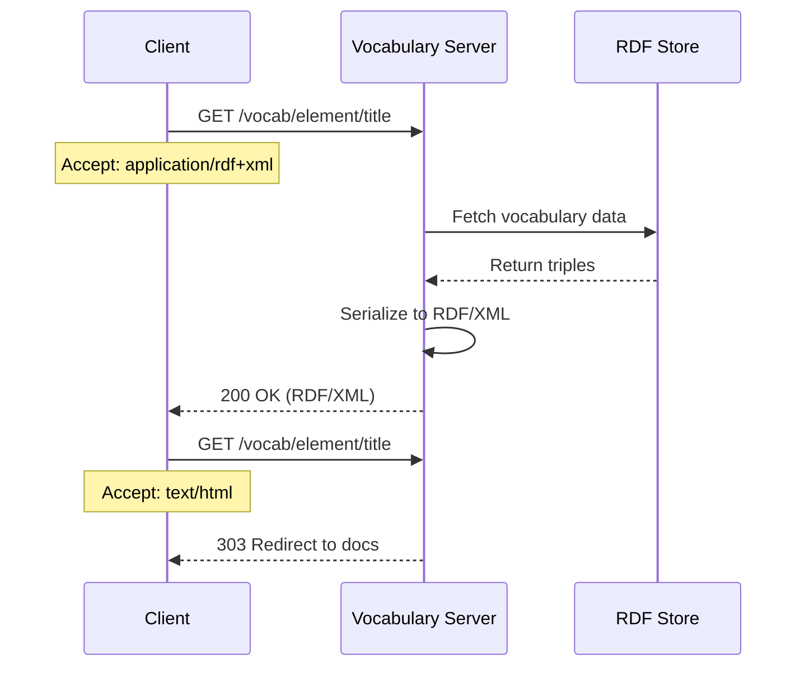

### 8. Translation Workflow with Crowdin

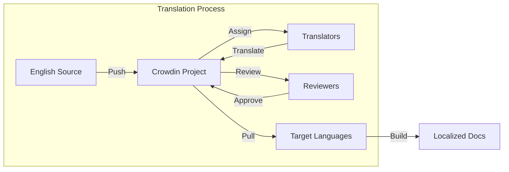

## Implementation Details

### Repository Structure

```
iflastandards/
├── .github/
│   ├── workflows/
│   │   ├── generate-vocabulary.yml
│   │   ├── publish-docs.yml
│   │   └── sync-translations.yml
│   └── actions/
│       ├── dctap-to-sheet/
│       ├── harvest-rdf/
│       └── generate-docs/
├── templates/
│   ├── docusaurus/
│   │   ├── base-config.js
│   │   └── components/
│   ├── dctap/
│   │   ├── elements.csv
│   │   └── values.csv
│   └── mdx/
│       ├── element.mdx
│       └── value.mdx
├── scripts/
│   ├── create-standard.js
│   ├── generate-sheets.js
│   └── publish-vocabulary.js
└── docs/
    ├── getting-started.md
    ├── workflow-guide.md
    └── technical-reference.md
```

### GitHub Actions Workflows

#### 1. Vocabulary Generation Workflow

```yaml
name: Generate Vocabulary
on:
  workflow_dispatch:
    inputs:
      standard:
        description: 'Standard identifier'
        required: true
      version:
        description: 'Vocabulary version'
        required: true

jobs:
  generate:
    runs-on: ubuntu-latest
    steps:
      - uses: actions/checkout@v3
      
      - name: Setup Node
        uses: actions/setup-node@v3
        with:
          node-version: 18
          
      - name: Harvest RDF from docs
        uses: ./github/actions/harvest-rdf
        with:
          docs-path: ./docs
          output-path: ./vocabularies
          
      - name: Validate RDF
        run: |
          npm run validate:rdf
          
      - name: Publish to vocabulary server
        uses: ./github/actions/publish-vocab
        with:
          vocabulary-path: ./vocabularies
          server-url: ${{ secrets.VOCAB_SERVER_URL }}
          api-key: ${{ secrets.VOCAB_API_KEY }}
```

#### 2. Documentation Publishing Workflow

```yaml
name: Publish Documentation
on:
  push:
    branches: [main]
  pull_request:
    branches: [main]

jobs:
  build-and-deploy:
    runs-on: ubuntu-latest
    steps:
      - uses: actions/checkout@v3
      
      - name: Build Docusaurus
        run: |
          npm install
          npm run build
          
      - name: Deploy to GitHub Pages
        if: github.ref == 'refs/heads/main'
        uses: peaceiris/actions-gh-pages@v3
        with:
          github_token: ${{ secrets.GITHUB_TOKEN }}
          publish_dir: ./build
```

### Existing Docusaurus Components

The ISBDM project has already developed several reusable components that can be leveraged:

#### Core Components

1. **VocabularyTable** - Display and filter vocabulary entries with multilingual support
   - Path: `src/components/global/VocabularyTable/index.tsx`
   - Features: CSV loading, filtering, i18n integration, profile validation

2. **ElementReference** - Reference other elements with proper linking
   - Path: `src/components/global/ElementReference/index.tsx`
   - Usage: `<ElementReference id="1025" />`

3. **ExampleTable** - Display examples in a structured format
   - Path: `src/components/global/ExampleTable/index.tsx`
   - Usage: `<ExampleTable examples={[...]} />`

4. **Mandatory** - Indicate mandatory elements
   - Path: `src/components/global/Mandatory/index.tsx`
   - Usage: `<Mandatory />`

5. **Unique** - Indicate unique/non-repeatable elements
   - Path: `src/components/global/Unique/index.tsx`
   - Usage: `<Unique />`

6. **InLink** / **OutLink** - Internal and external linking
   - Path: `src/components/global/InLink/index.tsx`, `OutLink/index.tsx`
   - Usage: `<InLink to="/docs/..." />`, `<OutLink to="https://..." />`

7. **SeeAlso** - Related content references
   - Path: `src/components/global/SeeAlso/index.tsx`
   - Usage: `<SeeAlso links={[...]} />`

8. **Figure** - Image display with proper captioning
   - Path: `src/components/global/Figure/index.tsx`
   - Usage: `<Figure src="/img/..." caption="..." />`

#### Usage in Element Documentation

```mdx
---
id: title-element
title: Title Element
mandatory: true
repeatable: false
---

import Mandatory from '@site/src/components/global/Mandatory';
import Unique from '@site/src/components/global/Unique';
import ExampleTable from '@site/src/components/global/ExampleTable';
import VocabularyTable from '@site/src/components/global/VocabularyTable';
import SeeAlso from '@site/src/components/global/SeeAlso';

# Title Element <Mandatory /> <Unique />

## Definition
The title element contains a name given to the resource.

## Examples
<ExampleTable examples={[
  {
    scenario: "Book with subtitle",
    value: "Digital Libraries : Principles and Practice",
    notes: "Use colon to separate main title and subtitle"
  }
]} />

## Controlled Vocabulary
<VocabularyTable source="/data/title-types.csv" />

## See Also
<SeeAlso links={[
  { to: "/docs/elements/alternative-title", label: "Alternative Title" },
  { to: "/docs/elements/translated-title", label: "Translated Title" }
]} />
```

### Google Sheets Integration

The project includes existing vocabulary sheet creation tools:

#### 1. Web Form Interface
- Path: `scripts/create-vocabulary-form.html`
- User-friendly form for editors to create vocabulary sheets
- Supports profile type selection, multilingual setup

#### 2. API Endpoint
- Path: `api/create-vocabulary.ts`
- Serverless function that triggers GitHub Actions
- Validates input and initiates vocabulary creation workflow

#### 3. GitHub Action Script
- Path: `scripts/create-vocabulary-sheet-action.ts`
- Creates Google Sheets with DCTAP profile structure
- Features:
  - Workbook organization by repository and profile type
  - Index sheet with hyperlinks to all vocabularies
  - Language-specific columns for translatable fields
  - DCTAP profile reference sheets

#### Example Usage Flow
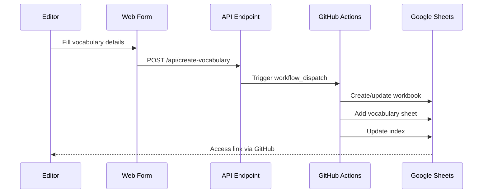

## Editor Interface Design

### Unified Editor Dashboard

A comprehensive web-based interface for managing standards documentation:

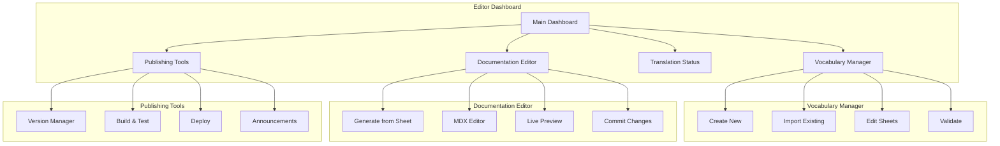

### Dashboard Components

#### 1. Main Dashboard
```typescript
interface DashboardProps {
  standards: Standard[];
  userRole: 'editor' | 'reviewer' | 'admin';
  activeProjects: Project[];
}

export function EditorDashboard({ standards, userRole, activeProjects }: DashboardProps) {
  return (
    <div className={styles.dashboard}>
      <header>
        <h1>IFLA Standards Editor</h1>
        <UserMenu role={userRole} />
      </header>
      
      <div className={styles.quickActions}>
        <QuickActionCard
          icon="vocabulary"
          title="Create Vocabulary"
          description="Start a new vocabulary from DCTAP profile"
          action="/vocabularies/create"
        />
        <QuickActionCard
          icon="document"
          title="Generate Documentation"
          description="Create docs from spreadsheet"
          action="/documentation/generate"
        />
        <QuickActionCard
          icon="translate"
          title="Translation Status"
          description="View and manage translations"
          action="/translations"
        />
        <QuickActionCard
          icon="publish"
          title="Publish Version"
          description="Release new standard version"
          action="/publish"
          requiresRole="editor"
        />
      </div>
      
      <div className={styles.projects}>
        <h2>Active Projects</h2>
        <ProjectList projects={activeProjects} />
      </div>
      
      <div className={styles.standards}>
        <h2>Standards Overview</h2>
        <StandardsGrid standards={standards} />
      </div>
    </div>
  );
}
```

#### 2. Vocabulary Creation Wizard
```typescript
export function VocabularyCreationWizard() {
  const [step, setStep] = useState(1);
  const [formData, setFormData] = useState<VocabularyConfig>({
    profileType: '',
    vocabularyName: '',
    title: '',
    description: '',
    languages: ['en']
  });
  
  return (
    <WizardContainer currentStep={step} totalSteps={4}>
      {step === 1 && (
        <ProfileSelectionStep
          profiles={['elements', 'values', 'custom']}
          selected={formData.profileType}
          onSelect={(type) => {
            setFormData({ ...formData, profileType: type });
            setStep(2);
          }}
        />
      )}
      
      {step === 2 && (
        <BasicInfoStep
          data={formData}
          onChange={(updates) => setFormData({ ...formData, ...updates })}
          onNext={() => setStep(3)}
          onBack={() => setStep(1)}
        />
      )}
      
      {step === 3 && (
        <LanguageSelectionStep
          selected={formData.languages}
          onChange={(langs) => setFormData({ ...formData, languages: langs })}
          onNext={() => setStep(4)}
          onBack={() => setStep(2)}
        />
      )}
      
      {step === 4 && (
        <ReviewAndCreateStep
          config={formData}
          onConfirm={async () => {
            const result = await createVocabularySheet(formData);
            window.location.href = result.editUrl;
          }}
          onBack={() => setStep(3)}
        />
      )}
    </WizardContainer>
  );
}
```

#### 3. Documentation Generator
```typescript
interface GeneratorProps {
  spreadsheetUrl: string;
  template: DocumentationTemplate;
}

export function DocumentationGenerator({ spreadsheetUrl, template }: GeneratorProps) {
  const [status, setStatus] = useState<GenerationStatus>('idle');
  const [progress, setProgress] = useState(0);
  const [generatedDocs, setGeneratedDocs] = useState<GeneratedDoc[]>([]);
  
  const generateDocs = async () => {
    setStatus('loading');
    
    // Parse spreadsheet
    const entries = await parseSpreadsheet(spreadsheetUrl);
    setProgress(25);
    
    // Validate entries
    const validation = await validateEntries(entries);
    if (validation.errors.length > 0) {
      setStatus('error');
      return;
    }
    setProgress(50);
    
    // Generate MDX files
    const docs = await generateMDXFiles(entries, template);
    setProgress(75);
    
    // Create pull request
    const pr = await createPullRequest(docs);
    setProgress(100);
    
    setGeneratedDocs(docs);
    setStatus('complete');
  };
  
  return (
    <div className={styles.generator}>
      <h2>Documentation Generator</h2>
      
      <div className={styles.inputs}>
        <SpreadsheetInput url={spreadsheetUrl} />
        <TemplateSelector template={template} />
      </div>
      
      {status === 'idle' && (
        <Button onClick={generateDocs}>
          Generate Documentation
        </Button>
      )}
      
      {status === 'loading' && (
        <ProgressBar value={progress} label="Generating documentation..." />
      )}
      
      {status === 'complete' && (
        <GenerationResults
          docs={generatedDocs}
          onReview={() => window.open(pr.url)}
          onEdit={() => navigateToEditor(generatedDocs)}
        />
      )}
    </div>
  );
}
```

#### 4. Translation Management
```typescript
export function TranslationDashboard() {
  const { translations, languages } = useTranslations();
  
  return (
    <div className={styles.translations}>
      <h2>Translation Status</h2>
      
      <LanguageOverview languages={languages} />
      
      <TranslationProgress
        total={translations.total}
        translated={translations.translated}
        approved={translations.approved}
        byLanguage={translations.byLanguage}
      />
      
      <div className={styles.actions}>
        <Button onClick={syncWithCrowdin}>
          Sync with Crowdin
        </Button>
        <Button onClick={exportTranslations}>
          Export Translations
        </Button>
      </div>
      
      <TranslationGrid
        items={translations.items}
        onEdit={(item) => openInCrowdin(item)}
      />
    </div>
  );
}
```

#### 5. Publishing Interface
```typescript
export function PublishingInterface() {
  const [version, setVersion] = useState('');
  const [releaseNotes, setReleaseNotes] = useState('');
  const [selectedComponents, setSelectedComponents] = useState({
    documentation: true,
    vocabularies: true,
    translations: false
  });
  
  return (
    <div className={styles.publishing}>
      <h2>Publish New Version</h2>
      
      <VersionSelector
        current={getCurrentVersion()}
        suggested={suggestNextVersion()}
        onChange={setVersion}
      />
      
      <ComponentSelector
        components={selectedComponents}
        onChange={setSelectedComponents}
      />
      
      <ReleaseNotesEditor
        value={releaseNotes}
        onChange={setReleaseNotes}
        suggestions={generateReleaseSuggestions()}
      />
      
      <PrePublishChecklist
        checks={[
          { name: 'All tests passing', status: 'passed' },
          { name: 'Documentation built', status: 'passed' },
          { name: 'Vocabularies validated', status: 'pending' },
          { name: 'Translations complete', status: 'warning' }
        ]}
      />
      
      <PublishActions
        onDryRun={() => performDryRun(version)}
        onPublish={() => publishVersion(version, releaseNotes)}
      />
    </div>
  );
}
```

### Mobile-Responsive Design

The editor interface adapts to different screen sizes:

```scss
// Editor responsive styles
.dashboard {
  display: grid;
  grid-template-columns: 250px 1fr;
  gap: 2rem;
  
  @media (max-width: 768px) {
    grid-template-columns: 1fr;
    
    .sidebar {
      position: fixed;
      transform: translateX(-100%);
      transition: transform 0.3s;
      
      &.open {
        transform: translateX(0);
      }
    }
  }
}

.quickActions {
  display: grid;
  grid-template-columns: repeat(auto-fit, minmax(250px, 1fr));
  gap: 1rem;
}

.editorPanel {
  display: flex;
  flex-direction: row;
  
  @media (max-width: 1024px) {
    flex-direction: column;
    
    .preview {
      position: sticky;
      top: 0;
      max-height: 40vh;
    }
  }
}
```

### Accessibility Features

1. **Keyboard Navigation**: Full keyboard support for all interactions
2. **Screen Reader Support**: ARIA labels and live regions
3. **High Contrast Mode**: Automatic adaptation to system preferences
4. **Focus Indicators**: Clear visual focus states
5. **Error Announcements**: Screen reader-friendly error messages

## Security and Permissions

### GitHub Repository Permissions

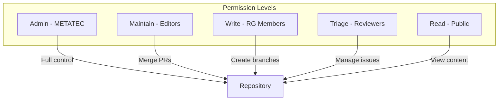

### Workflow Permissions

```yaml
# Example: Restricted workflow permissions
name: Publish Vocabulary
on:
  workflow_dispatch:

permissions:
  contents: read
  pages: write
  id-token: write

jobs:
  publish:
    runs-on: ubuntu-latest
    environment:
      name: production
      url: ${{ steps.deployment.outputs.page_url }}
    steps:
      - name: Check permissions
        uses: actions/github-script@v6
        with:
          script: |
            const { data: { permissions } } = await github.rest.repos.getCollaboratorPermission({
              owner: context.repo.owner,
              repo: context.repo.repo,
              username: context.actor
            });
            
            if (!['admin', 'maintain'].includes(permissions)) {
              core.setFailed('Insufficient permissions to publish');
            }
```

## Integration Points

### 1. Vocabulary Server Integration

```typescript
// Vocabulary server client for content negotiation
class VocabularyServerClient {
  constructor(private baseUrl: string, private apiKey: string) {}
  
  async publish(vocabulary: RDFVocabulary): Promise<void> {
    const formats = ['turtle', 'jsonld', 'rdfxml', 'ntriples'];
    
    for (const format of formats) {
      const serialized = await vocabulary.serialize(format);
      
      await fetch(`${this.baseUrl}/vocabularies/${vocabulary.id}`, {
        method: 'PUT',
        headers: {
          'Authorization': `Bearer ${this.apiKey}`,
          'Content-Type': getContentType(format),
          'X-Vocabulary-Version': vocabulary.version
        },
        body: serialized
      });
    }
  }
  
  async setupContentNegotiation(vocabularyId: string): Promise<void> {
    await fetch(`${this.baseUrl}/negotiate/${vocabularyId}`, {
      method: 'POST',
      headers: {
        'Authorization': `Bearer ${this.apiKey}`,
        'Content-Type': 'application/json'
      },
      body: JSON.stringify({
        htmlRedirect: `https://standards.ifla.org/${vocabularyId}`,
        formats: {
          'application/rdf+xml': `${this.baseUrl}/vocab/${vocabularyId}.rdf`,
          'text/turtle': `${this.baseUrl}/vocab/${vocabularyId}.ttl`,
          'application/ld+json': `${this.baseUrl}/vocab/${vocabularyId}.jsonld`
        }
      })
    });
  }
}
```

### 2. Crowdin Integration

```javascript
// crowdin.yml configuration
project_id_env: CROWDIN_PROJECT_ID
api_token_env: CROWDIN_API_TOKEN
preserve_hierarchy: true
files:
  - source: /docs/**/*.mdx
    translation: /i18n/%locale%/docs/**/%original_file_name%
    ignore:
      - /docs/**/temp/
      - /docs/**/_*.mdx
    update_option: update_as_unapproved
    content_segmentation: true
    translatable_elements:
      - "//text()"
      - "//@title"
      - "//@alt"
```

### 3. CI/CD Pipeline

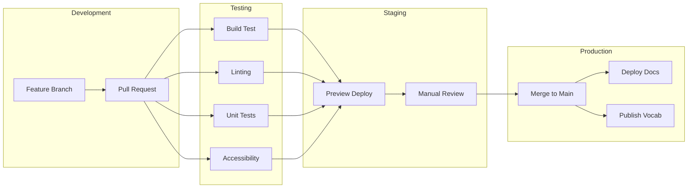

## Deployment Strategy

### Multi-Environment Setup

```typescript
// Environment configuration
interface Environment {
  name: string;
  url: string;
  branch: string;
  autoDeployEnabled: boolean;
}

const environments: Environment[] = [
  {
    name: 'development',
    url: 'https://dev.standards.ifla.org',
    branch: 'develop',
    autoDeployEnabled: true
  },
  {
    name: 'staging',
    url: 'https://staging.standards.ifla.org',
    branch: 'staging',
    autoDeployEnabled: true
  },
  {
    name: 'production',
    url: 'https://standards.ifla.org',
    branch: 'main',
    autoDeployEnabled: false // Manual approval required
  }
];
```

### Deployment Workflow

```yaml
name: Deploy to Environment
on:
  push:
    branches: [develop, staging, main]
  workflow_dispatch:
    inputs:
      environment:
        description: 'Target environment'
        required: true
        type: choice
        options:
          - development
          - staging
          - production

jobs:
  deploy:
    runs-on: ubuntu-latest
    steps:
      - name: Determine environment
        id: env
        run: |
          if [ "${{ github.event_name }}" == "workflow_dispatch" ]; then
            echo "environment=${{ inputs.environment }}" >> $GITHUB_OUTPUT
          else
            case "${{ github.ref }}" in
              refs/heads/develop) echo "environment=development" >> $GITHUB_OUTPUT ;;
              refs/heads/staging) echo "environment=staging" >> $GITHUB_OUTPUT ;;
              refs/heads/main) echo "environment=production" >> $GITHUB_OUTPUT ;;
            esac
          fi
      
      - name: Deploy to ${{ steps.env.outputs.environment }}
        uses: ./.github/actions/deploy
        with:
          environment: ${{ steps.env.outputs.environment }}
          token: ${{ secrets.DEPLOY_TOKEN }}
```

## Maintenance and Support

### Monitoring and Analytics

```typescript
// Analytics integration for usage tracking
interface StandardsAnalytics {
  trackPageView(page: string, standard: string): void;
  trackVocabularyAccess(vocab: string, format: string): void;
  trackTranslation(locale: string, page: string): void;
}

class AnalyticsService implements StandardsAnalytics {
  constructor(private ga4Id: string) {
    this.initializeGA4();
  }
  
  trackPageView(page: string, standard: string): void {
    gtag('event', 'page_view', {
      page_path: page,
      custom_dimension_1: standard,
      custom_dimension_2: 'documentation'
    });
  }
  
  trackVocabularyAccess(vocab: string, format: string): void {
    gtag('event', 'vocabulary_access', {
      vocabulary_id: vocab,
      format: format,
      custom_dimension_2: 'vocabulary'
    });
  }
  
  trackTranslation(locale: string, page: string): void {
    gtag('event', 'translation_view', {
      language: locale,
      page_path: page,
      custom_dimension_2: 'translation'
    });
  }
}
```

### Backup and Recovery

```yaml
# Automated backup workflow
name: Backup Standards Data
on:
  schedule:
    - cron: '0 2 * * *' # Daily at 2 AM UTC
  workflow_dispatch:

jobs:
  backup:
    runs-on: ubuntu-latest
    steps:
      - name: Backup Docusaurus content
        run: |
          tar -czf docs-backup-$(date +%Y%m%d).tar.gz docs/
          
      - name: Backup vocabulary RDF
        run: |
          tar -czf vocab-backup-$(date +%Y%m%d).tar.gz vocabularies/
          
      - name: Upload to backup storage
        uses: actions/upload-artifact@v3
        with:
          name: standards-backup-$(date +%Y%m%d)
          path: |
            docs-backup-*.tar.gz
            vocab-backup-*.tar.gz
          retention-days: 90
```

### Support Documentation

```markdown
## Review Group Support Guide

### Getting Started
1. **Access Your Spreadsheet**
   - Check your email for the Google Sheets invitation
   - Click the link to open your vocabulary template
   - Bookmark the spreadsheet for easy access

2. **Understanding the Template**
   - **Elements Tab**: Define the metadata elements
   - **Values Tab**: Define controlled vocabulary terms
   - **Constraints Tab**: Specify validation rules

3. **Collaboration Guidelines**
   - Use comments for discussions
   - Highlight cells needing review
   - Track changes in the revision history

### Common Tasks

#### Adding a New Element
1. Go to the Elements tab
2. Add a new row
3. Fill in required fields:
   - ID (unique identifier)
   - Label (display name)
   - Definition (clear description)
   - Mandatory (yes/no)
   - Repeatable (yes/no)

#### Requesting Documentation Generation
1. Ensure spreadsheet is complete
2. Contact your editor
3. Review generated documentation
4. Provide feedback through GitHub issues
```

## Appendices

### A. DCTAP Profile Example

```csv
shapeID,shapeLabel,propertyID,propertyLabel,mandatory,repeatable,valueShape,valueDatatype,valueConstraint,note
:Book,Book,dct:title,Title,true,false,,,,"Main title of the book"
:Book,Book,dct:creator,Creator,true,true,:Person,,,"Author or creator"
:Book,Book,dct:date,Publication Date,true,false,,,xsd:date,"Date of publication"
:Book,Book,dct:identifier,ISBN,false,true,,,pattern:[0-9]{13},"ISBN-13 identifier"
:Person,Person,foaf:name,Name,true,false,,,,"Full name of person"
:Person,Person,foaf:mbox,Email,false,true,,,pattern:^[^@]+@[^@]+$,"Email address"
```

### B. Example MDX Documentation Page

```mdx
---
id: title-element
title: Title Element
sidebar_label: Title
rdf:
  "@context": {
    "@vocab": "http://purl.org/dc/terms/",
    "rdfs": "http://www.w3.org/2000/01/rdf-schema#",
    "skos": "http://www.w3.org/2004/02/skos/core#"
  }
  "@id": "title"
  "@type": ["rdf:Property", "owl:DatatypeProperty"]
  "rdfs:label": 
    - "@value": "Title"
      "@language": "en"
    - "@value": "Titre"
      "@language": "fr"
  "rdfs:comment":
    - "@value": "A name given to the resource"
      "@language": "en"
    - "@value": "Un nom donné à la ressource"
      "@language": "fr"
  "rdfs:domain": "Resource"
  "rdfs:range": "rdfs:Literal"
  "skos:example": ["Main title", "Subtitle", "Alternative title"]
version: 1.0.0
status: stable
mandatory: true
repeatable: false
---

import ElementDefinition from '@site/src/components/ElementDefinition';
import ExampleTable from '@site/src/components/ExampleTable';

# Title Element

<ElementDefinition 
  mandatory={true}
  repeatable={false}
  constraints={["Must not be empty", "Maximum 500 characters"]}
/>

## Definition

The title element contains a name given to the resource. This is typically the name by which the resource is formally known.

## Usage Guidelines

### General Rules
- Record the title exactly as it appears on the resource
- Include subtitles separated by appropriate punctuation
- For translations, use the original language title as the main title

### Special Cases

#### Multiple Titles
When a resource has multiple titles:
1. Record the most prominent title first
2. Add alternative titles in separate title elements
3. Use appropriate title type indicators

<ExampleTable examples={[
  {
    scenario: "Book with subtitle",
    value: "Digital Libraries : Principles and Practice",
    notes: "Use colon to separate main title and subtitle"
  },
  {
    scenario: "Translated work",
    value: "Les Misérables",
    notes: "Use original language title"
  }
]} />

## Related Elements

- <Link to="/docs/elements/alternative-title">Alternative Title</Link>
- <Link to="/docs/elements/translated-title">Translated Title</Link>
- <Link to="/docs/elements/series-title">Series Title</Link>
```

### C. Vocabulary Server API Specification

```yaml
openapi: 3.0.0
info:
  title: IFLA Vocabulary Server API
  version: 1.0.0
  description: Content negotiation and vocabulary serving for IFLA standards

paths:
  /vocabularies/{vocabId}:
    get:
      summary: Retrieve vocabulary in requested format
      parameters:
        - name: vocabId
          in: path
          required: true
          schema:
            type: string
        - name: Accept
          in: header
          schema:
            type: string
            enum:
              - application/rdf+xml
              - text/turtle
              - application/ld+json
              - text/html
      responses:
        200:
          description: Vocabulary in requested format
        303:
          description: Redirect to HTML documentation
        406:
          description: Requested format not available
          
    put:
      summary: Publish or update vocabulary
      security:
        - bearerAuth: []
      parameters:
        - name: vocabId
          in: path
          required: true
          schema:
            type: string
      requestBody:
        required: true
        content:
          application/rdf+xml:
            schema:
              type: string
          text/turtle:
            schema:
              type: string
          application/ld+json:
            schema:
              type: object
      responses:
        201:
          description: Vocabulary created
        204:
          description: Vocabulary updated
        401:
          description: Unauthorized
```

### D. Migration Guide for Legacy Standards

```typescript
// Legacy standard migration tool
interface LegacyStandard {
  pdfPath: string;
  existingVocabularies?: string[];
  metadata: StandardMetadata;
}

class LegacyMigrationService {
  async migrate(legacy: LegacyStandard): Promise<MigrationResult> {
    // Step 1: Extract content from PDF
    const extracted = await this.extractFromPDF(legacy.pdfPath);
    
    // Step 2: Parse existing vocabularies
    const vocabs = await this.parseExistingVocabularies(
      legacy.existingVocabularies
    );
    
    // Step 3: Generate DCTAP profile
    const profile = this.generateDCTAPProfile(extracted, vocabs);
    
    // Step 4: Create review spreadsheet
    const sheetId = await this.createReviewSpreadsheet(profile);
    
    // Step 5: Populate with extracted data
    await this.populateSpreadsheet(sheetId, extracted);
    
    // Step 6: Generate initial documentation
    const docs = await this.generateInitialDocs(extracted);
    
    return {
      spreadsheetId: sheetId,
      documentationPath: docs.path,
      extractedElements: extracted.elements.length,
      mappedVocabularies: vocabs.length
    };
  }
  
  private async extractFromPDF(pdfPath: string): Promise<ExtractedContent> {
    // Use AI-assisted extraction
    const text = await extractText(pdfPath);
    const structured = await this.aiParse(text);
    
    return {
      elements: structured.elements,
      relationships: structured.relationships,
      examples: structured.examples,
      glossary: structured.glossary
    };
  }
}
```

## Conclusion

This comprehensive documentation management system provides IFLA with a modern, scalable, and user-friendly solution for managing library standards. By leveraging Docusaurus, GitHub, and automated workflows, the system enables:

1. **Collaborative Development**: Review groups can work together effectively using familiar tools
2. **Version Control**: Both documentation and vocabularies are properly versioned and tracked
3. **Multilingual Support**: Integrated translation workflows ensure global accessibility
4. **Technical Standards**: RDF vocabularies are automatically generated and published
5. **Accessibility**: Non-technical users can contribute through spreadsheets and web interfaces
6. **Sustainability**: Built on open-source technologies with clear maintenance paths

The system balances the needs of technical and non-technical users while maintaining the rigor required for international standards development.